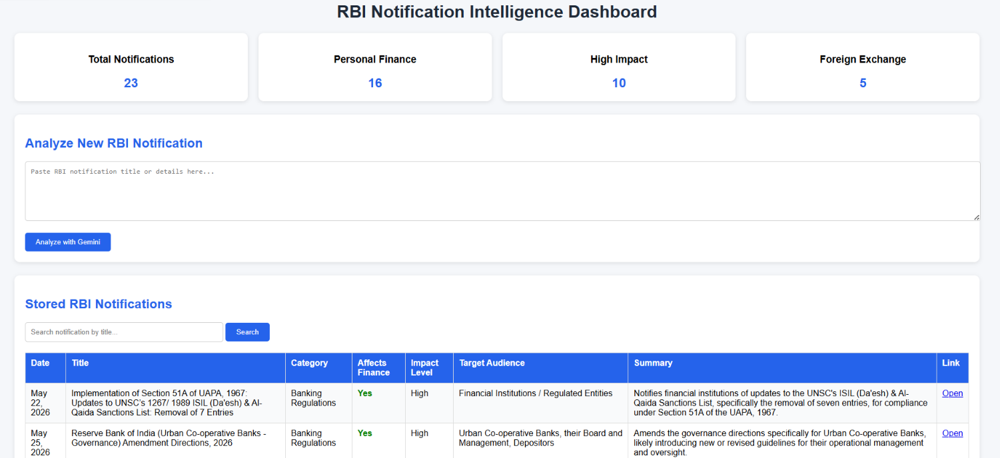

# RBI Notification Intelligence Dashboard

## Overview

RBI Notification Intelligence Dashboard is a Python-based project that automatically collects RBI notifications, stores them in a database, classifies them using Google Gemini AI, and presents the results through an interactive web dashboard.

The project helps users quickly understand RBI notifications without reading lengthy regulatory documents. It identifies the category of each notification, determines whether it affects personal finance, estimates the impact level, identifies the target audience, and generates a concise summary.

---
## Dashboard Preview


## Features

### RBI Notification Collection

* Scrapes RBI notifications from the official RBI website.
* Extracts notification details such as:

  * Date
  * Title
  * Link
  * Content

### Database Storage

* Stores all notifications in SQLite.
* Prevents duplicate entries.
* Maintains structured historical records.
* Dates stored in ISO format (`YYYY-MM-DD`) for proper chronological sorting.

### Gemini AI Classification

For every notification, Gemini AI automatically determines:

* Category
* Whether it affects personal finance
* Impact level
* Target audience
* Summary
* Explanation

### Supported Categories

* Interest Rates
* Foreign Exchange
* Markets
* Banking Regulations
* Savings Schemes
* Insurance
* Taxes
* Other

### Interactive Dashboard

The Flask dashboard provides:

* Notification search by title
* Gemini-powered notification analysis (with rate limiting and daily quota)
* Notification summaries
* Impact levels
* Target audience information
* Links to original RBI notifications

### Dashboard Statistics

The dashboard displays:

* Total Notifications
* Personal Finance Notifications
* High Impact Notifications
* Foreign Exchange Notifications

### Security Features

* **Rate Limiting**: 5 Gemini analysis requests per minute per IP
* **Daily Quota**: Maximum 50 Gemini analyses per day (global)
* **Honeypot Protection**: Hidden form field to block automated bots
* **Input Validation**: Minimum 20 characters required for analysis
* **Client-side Cooldown**: 10-second button disable after each submission

---

## Technology Stack

### Backend

* Python
* Flask (with built-in rate limiting)

### Database

* SQLite

### AI

* Google Gemini 2.5 Flash

### Web Scraping

* Requests
* BeautifulSoup

### Frontend

* HTML
* CSS
* Jinja Templates

---

## Project Structure

```text
RBI-Notification-Digest/
│
├── Day1/
│   ├── scrapper.py          # Scrapes RBI notifications and saves to DB
│   └── rbi.html             # Saved HTML page (for offline testing)
│
├── Day2/
│   ├── database.py          # Creates the database with all columns
│   ├── add_gemini_colums.py # Adds Gemini classification columns
│   ├── update_db.py         # Adds summary, impact, audience columns
│   └── queries.py           # Sample database queries
│
├── Day3/
│   ├── classifier.py           # Rule-based notification classifier
│   ├── gemini_classifier.py    # Gemini AI-powered classifier
│   └── notifications_balanced.csv  # Training/reference data
│
├── templates/
│   └── index.html           # Dashboard HTML template
│
├── assets/
│   └── dashboard.png        # Dashboard screenshot
│
├── app.py                   # Flask web application
├── daily_job.py             # Daily pipeline (scrape → classify → cleanup)
├── scheduler.py             # Midnight cron scheduler (runs daily_job)
├── migrate_dates.py         # One-time date format migration script
├── classifier_data.py       # Classifier data helper
├── digest_generator.py      # Text digest generator
├── .env.example             # Environment variables template
├── .gitignore
├── requirements.txt
└── README.md
```

All scripts use `if __name__ == "__main__"` guards — functions can be imported without side effects.

---

## Prerequisites

* **Python 3.8+**
* **Gemini API Key** — Get one free from [Google AI Studio](https://aistudio.google.com/apikey)

---

## Installation

### 1. Clone Repository

```bash
git clone https://github.com/Ananya92006/RBI-Notification-Digest.git
cd RBI-Notification-Digest
```

### 2. Create Virtual Environment

```bash
python -m venv .venv
```

Activate:

#### Windows

```bash
.venv\Scripts\activate
```

#### Linux/Mac

```bash
source .venv/bin/activate
```

### 3. Install Dependencies

```bash
pip install -r requirements.txt
```

### 4. Configure Environment Variables

```bash
cp .env.example .env
```

Open `.env` and replace the placeholder with your actual Gemini API key:

```env
GEMINI_API_KEY=your_actual_api_key_here
```

---

## Running the Project

Follow these steps **in order**:

### Step 1: Scrape RBI Notifications

Scrapes notifications from the RBI website and saves them to the database.

```bash
python Day1/scrapper.py
```

> **Note**: This creates `finance_digest.db` and populates it with notification data. Dates are automatically stored in ISO format (`YYYY-MM-DD`).

### Step 2: Run Rule-Based Classification

Classifies notifications using keyword-based rules.

```bash
python Day3/classifier.py
```

### Step 3: Run Gemini AI Classification

Classifies notifications using Google Gemini AI for more accurate results.

```bash
python Day3/gemini_classifier.py
```

> **Note**: This step requires a valid Gemini API key. It processes only unclassified notifications and respects API rate limits (2-second delay between calls).

### Step 4: Launch Dashboard

```bash
python app.py
```

Open your browser and visit:

```text
http://127.0.0.1:5000
```

---

## Automatic Daily Updates (Scheduler)

The project includes a scheduler that **automatically runs at midnight every day** to:

1. **Scrape** new RBI notifications
2. **Classify** only unclassified notifications (using rule-based + Gemini AI)
3. **Delete** notifications older than 30 days

### Option 1: Python Scheduler (Recommended)

Run the built-in scheduler as a background process:

```bash
# Windows
start /b python scheduler.py > scheduler.log 2>&1

# Linux/Mac
nohup python scheduler.py > scheduler.log 2>&1 &
```

Logs are written to `scheduler.log`.

### Option 2: Windows Task Scheduler

1. Open Task Scheduler → Create Basic Task
2. Set trigger: Daily at 12:00 AM
3. Set action: Start a program
4. Program: `python`
5. Arguments: `daily_job.py`
6. Start in: `C:\path\to\RBI-Notification-Digest`

### Option 3: Linux Cron

```bash
crontab -e
```

Add this line (runs at midnight every day):

```cron
0 0 * * * cd /path/to/RBI-Notification-Digest && python daily_job.py >> cron.log 2>&1
```

### Run Manually (One-Time)

You can also run the daily pipeline manually:

```bash
python daily_job.py
```

---

## Analyzing Notifications on the Dashboard

The dashboard includes an "Analyze with Gemini" feature that lets you paste any RBI notification text for instant AI analysis.

**Protections in place:**

| Protection | Description |
|---|---|
| Rate Limit | 5 requests per minute per IP |
| Daily Quota | 50 analyses per day (global) |
| Honeypot | Hidden field blocks bots |
| Min Input | At least 20 characters required |
| Cooldown | Button disabled for 10s after submit |

---

## Example Dashboard Insights

For each notification, the dashboard displays:

* Category
* Personal Finance Impact
* Impact Level
* Target Audience
* Summary
* Source Link

Example:

| Field           | Value                           |
| --------------- | ------------------------------- |
| Category        | Foreign Exchange                |
| Affects Finance | Yes                             |
| Impact Level    | High                            |
| Target Audience | NRI Depositors                  |
| Summary         | Swap facility for FCNR deposits |

---

## Database Migration (Existing Users)

If you had an older version with dates stored as strings (e.g., `"Jun 10, 2026"`), run the migration script to convert them to ISO format:

```bash
python migrate_dates.py
```

This is safe to run multiple times — it skips already-converted dates.

---

## Future Enhancements

* Category Filters
* Charts and Visual Analytics
* Email Notifications
* Advanced AI Summaries
* User Authentication
* Export to CSV/PDF

---

## Learning Outcomes

Through this project:

* Learned web scraping using BeautifulSoup
* Built SQLite database workflows
* Integrated Generative AI using Gemini API
* Developed a Flask web application
* Implemented API security and rate limiting
* Built automated scheduling with cron jobs
* Designed an end-to-end AI-powered information system

---

## Author

Ananya Gupta

Information Technology Student

AI • Data Science • Software Development
